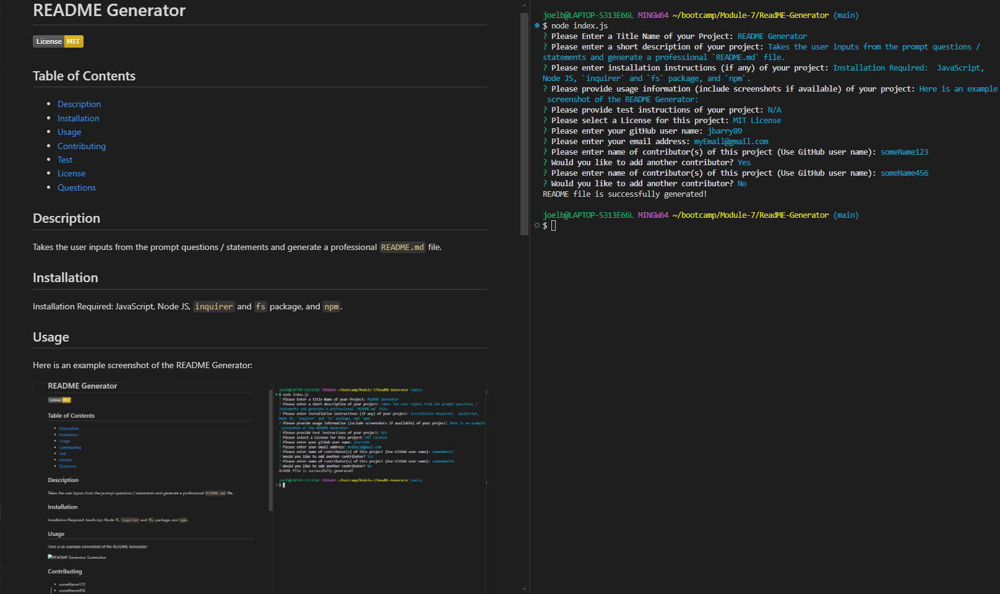

# README Generator

  

  ## Table of Contents

  * [Description](#description)
  * [Installation](#installation)
  * [Usage](#usage)
  * [Contributing](#contributing)
  * [Test](#test)
  * [License](#license)
  * [Questions](#questions)

  ## Description
  Takes the user inputs from the prompt questions / statements and generate a professional `README.md` file.

  ## Installation
  JavaScript, Node JS, `inquirer` and `fs` package, and `npm`.

  ## Usage
  Generate professional `README` file.

  

  ## Contributing
  someName123

  ## Test
  N/A

  ## License
  This project is Licensed under the MIT License.

  ## Questions
  Feel Free to contact me for any additional questions
  * GitHub: [jbarry89](https://github.com/jbarry89/)
  * Email: myEmail@gmail.com
  